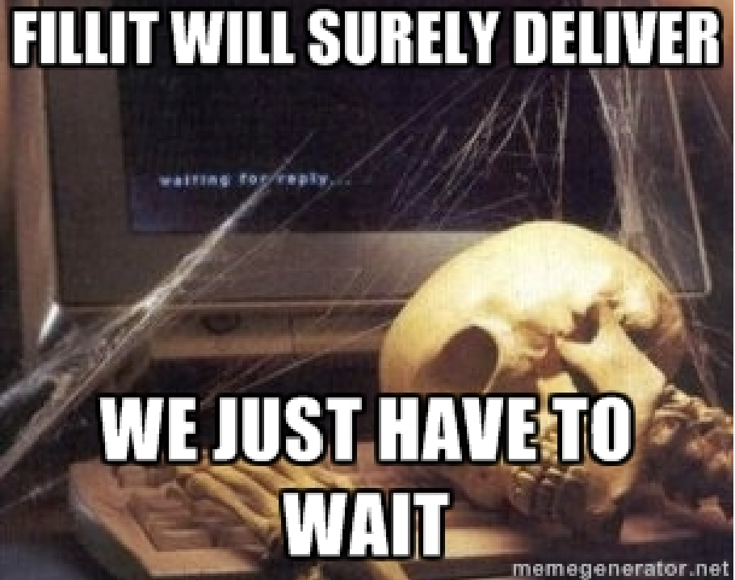
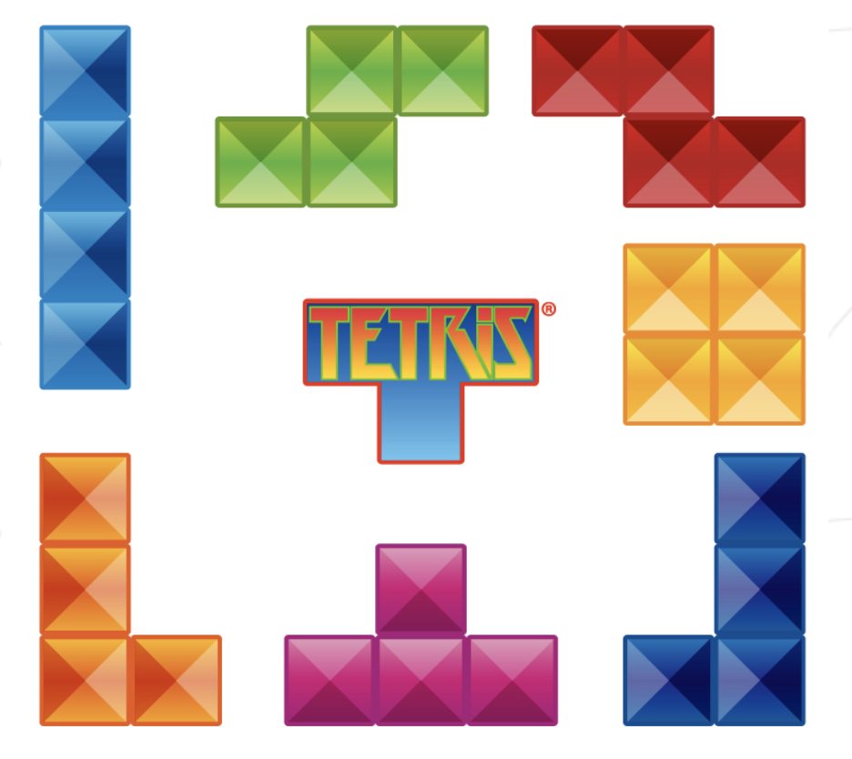
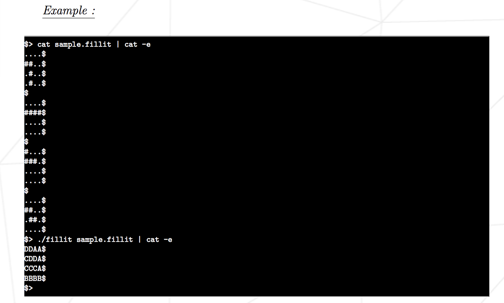
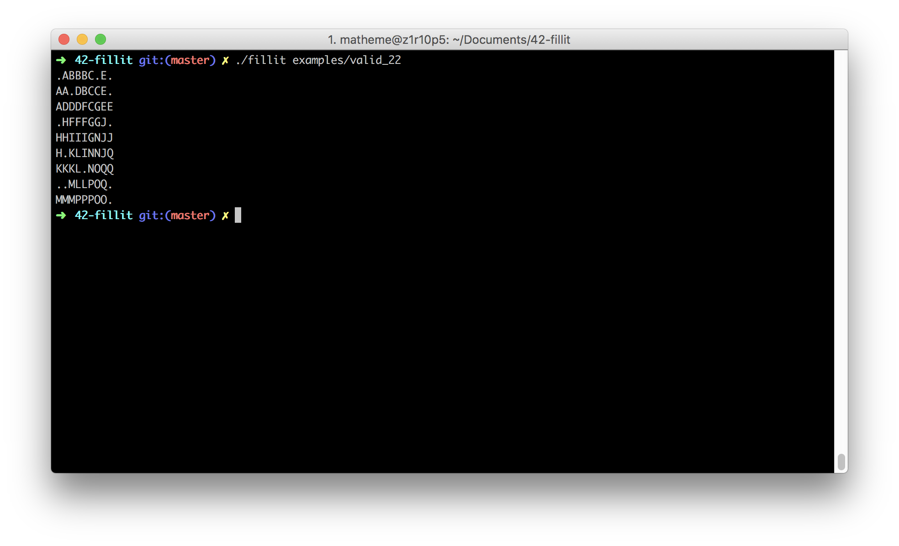
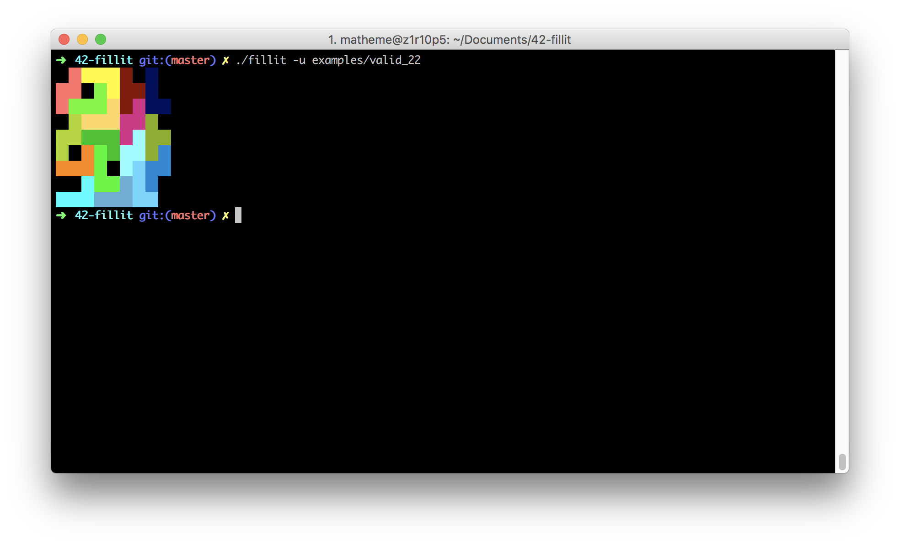

# Cursus 42
we have continue our cursus with a project name fillit
I put the subject in a folder name ressources/subject
I have realise this project with eschnell (another student of the 42-lyon school)
this is the first real program we realize inside the cursus 42

2018-11-19 --> 2018-12-05
# 42-fillit Can you feel it ?

## Foreword
Alexey Leonidovich (Read the subject)

## Objectives
Fillit is not about recoding Tetris, even if it’s still a variant of this game. Your program will take a file as parameter, which contains a list of Tetriminos, and arrange them
in order to create the smallest square possible.

## Introduction
Fillit is a project that let you discover and/or familiarize yourself with a recurring
problematic in programming: searching the optimal solution among a huge set of possibilities, in a respectable timing. In this particular project, you will have to find a way to
assemble a given Tetriminos set altogether in the smallest possible square.

## Tetriminos
The description of a Tetriminos must respect the following rules :
• Precisely 4 lines of 4 characters, each followed by a new line (well... a 4x4 square).
• A Tetrimino is a classic piece of Tetris composed of 4 blocks.
• Each character must be either a block character(’#’ ) or an empty character (’.’).
• Each block of a Tetrimino must touch at least one other block on any of his 4 sides
(up, down, left and right).
The tetriminos is give to the program inside a maps

For more explaination please read the subject

## Compiling and run our program
Run the command `make` at the root of the repo then
Run the program with the command `./fillit maps_name`

## Expected Program output

## Our Program output

## Bonus
We have realise a bonus for this project
activate the bonus part with the option -u like this
`./fillit -u maps_name`

